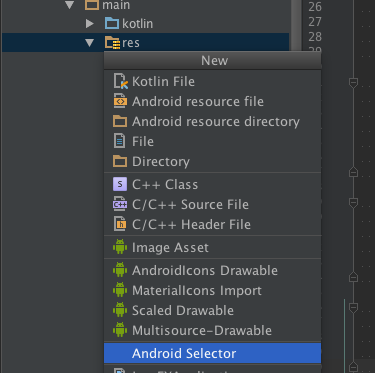

# android-selector-intellij-plugin
:art: Generate background drawable for selector.

Select `New -> Android Selector` with your `res` directory.

- ripple drawable is generated in drawable-v21 directory.
- normal drawable is generated in drawable directory.

## Demo

| Lollipop &lt; | Lollipop &gt;= | 
|---------------|----------------|
| ![demo1][d1]  | ![demo2][d2]   |

## Dependency
- com.android.support:appcompat-v7:22.+

## License
MIT © [Jaewe Heo][importre]

[importre]: http://import.re
[d1]: images/demo1.png
[d2]: images/demo2.png
