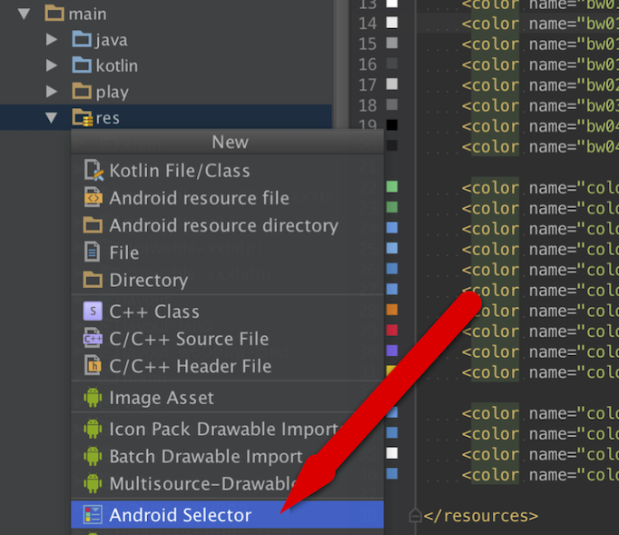
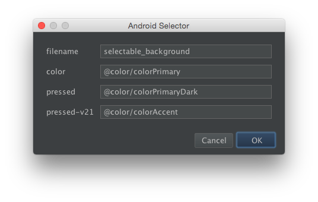

[](https://android-arsenal.com/details/1/2342)

# android-selector-intellij-plugin
:art: Generate selectors for background drawable.


## Usage
- Set your colors.

```xml
    <color name="colorPrimary">#519FE5</color>
    <color name="colorPrimaryDark">#388AC6</color>
    <color name="colorAccent">#FFFFFF</color>
```

- Select `New -> Android Selector` with your `res` directory.



- Set filename, color, pressed and pressed-v21.



> ripple drawable is generated in drawable-v21 directory.  
> normal drawable is generated in drawable directory.

- Use the drawable.

```xml
    <android.support.v7.widget.AppCompatButton
        android:layout_width="wrap_content"
        android:layout_height="wrap_content"
        android:layout_margin="16dp"
        android:background="@drawable/<GENERATED_DRAWABLE>"
        android:gravity="center"
        android:minWidth="100dp"
        android:text="pressed" />
```


## Demo

| Lollipop &gt; | Lollipop &lt;= | 
|---------------|----------------|
| ![demo1][d1]  | ![demo2][d2]   |


## Dependency
- com.android.support:appcompat-v7:22.+


## License
MIT © [Jaewe Heo][importre]


[importre]: http://import.re
[d1]: images/demo1.png
[d2]: images/demo2.png
